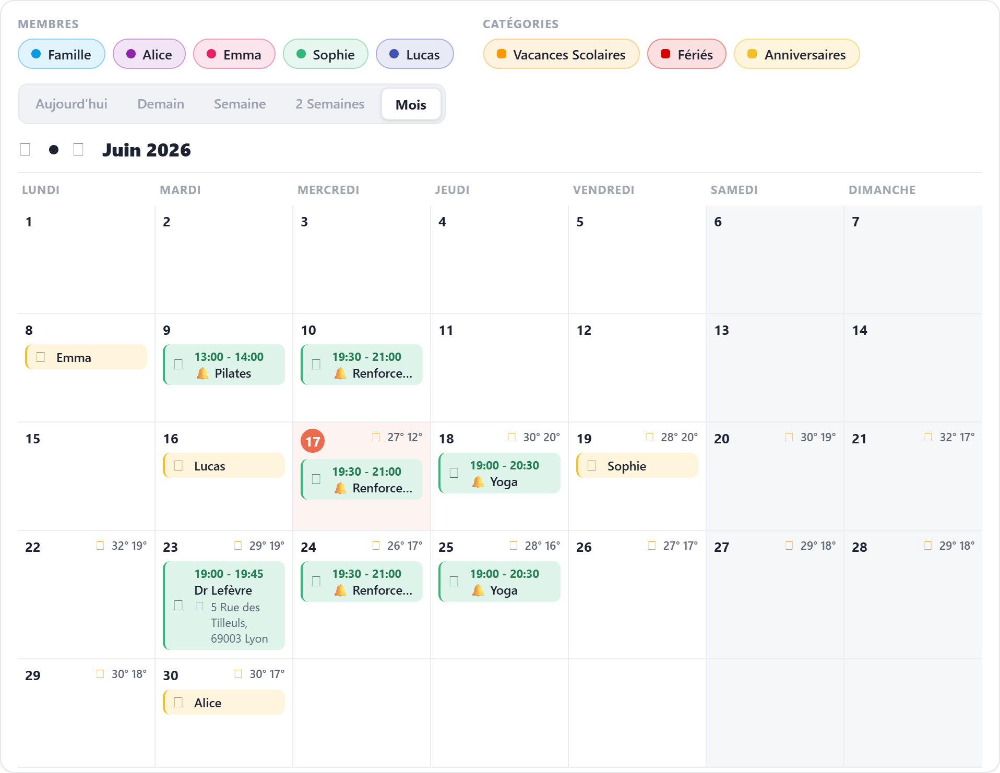
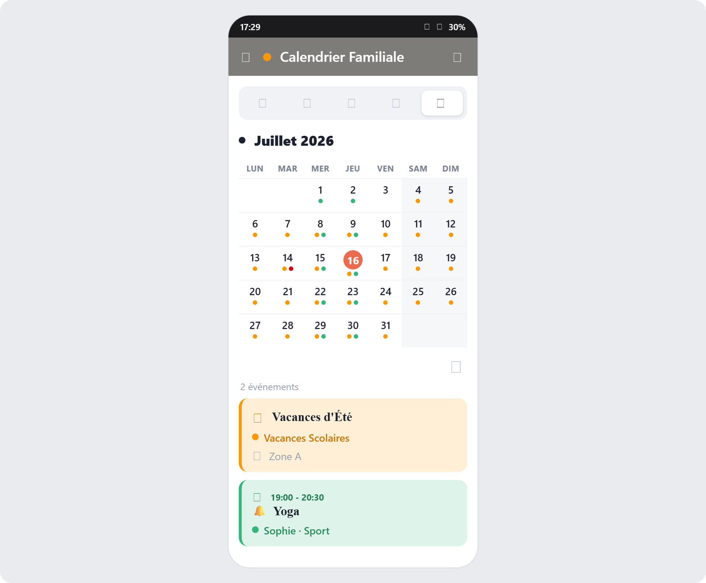

# Family Calendar Card

[](README.md) [](README.fr.md)

Une carte calendrier familial pour Home Assistant. Elle affiche les événements de plusieurs calendriers avec une interface tactile, trois thèmes, la météo et une gestion complète des événements (création, modification, suppression) — pensée aussi bien pour une tablette murale que pour un téléphone ou un ordinateur.

> **Renommée en v2.0.0** (anciennement *Skylight Family Calendar Card*). Le type de carte est `custom:family-calendar-card`. Les tableaux de bord qui utilisent encore `custom:skylight-family-calendar-card` continuent de fonctionner : l'ancien type est conservé comme alias.
>
> ⚠️ **Mise à jour depuis avant le renommage ?** HACS peut laisser une **ressource Lovelace en double** (l'ancienne `ha-skylight-family-calendar-card`), qui sert une vieille copie et masque la mise à jour. **Correction :** **Paramètres → Tableaux de bord → (⋮ en haut à droite) → Ressources**, supprimer l'entrée pointant vers `/hacsfiles/ha-skylight-family-calendar-card/…`, garder celle vers `/hacsfiles/family-calendar-card/…`, puis recharger de force (`Ctrl+Maj+R`).

## Passer à la version 3.0

La version 3.0 supprime des options qui n'avaient plus d'effet ou qui contredisaient la carte. **Rien ne casse** : une option inconnue laissée dans votre YAML est simplement ignorée. Seules les fonctions ci-dessous disparaissent.

| Option supprimée | Pourquoi | Que faire |
|---|---|---|
| `days` | Ignorée depuis l'arrivée des vues : c'est la vue choisie qui fixe le nombre de jours | Utiliser `defaultView` / `views` |
| `aiQuickAdd`, `aiTaskEntity` | La saisie rapide IA par texte a été retirée de l'interface depuis longtemps — ces options ne faisaient plus rien | Rien — la reconnaissance d'écriture (`geminiApiKey` / `claudeApiKey`) est inchangée |
| `actions` | Chaque appui déclenchait une action personnalisée et désactivait sans prévenir la modification des événements | Rien |
| `showLegend`, `legendToggle`, `calendars[].hideInLegend` | Faisaient doublon avec les filtres, toujours affichés, qui activent déjà chaque calendrier | Utiliser les filtres |
| `startingDayOffset` | Non documentée ; elle décalait aussi les vues *Aujourd'hui* et *Demain*, en contradiction avec leur nom | Utiliser `startingDay` |

Autres changements de la 3.0 :
- Modifier un événement récurrent propose désormais **« Cet événement uniquement »** ou **« Cet événement et les suivants »** (comme l'interface de Home Assistant). L'ancien choix *« Tous les événements »* réécrivait le début de la série à partir de l'occurrence cliquée et effaçait les occurrences passées.
- L'éditeur visuel est réorganisé et suit la langue de votre Home Assistant (français ou anglais).

## Aperçu — thème « familial »

Vue mois sur ordinateur / tablette murale :



Vue mois sur mobile (style Samsung Calendar — pastilles colorées + panneau du jour au toucher) :



## Fonctionnalités

### Gestion des événements
- **Créer, modifier et supprimer** des événements directement depuis la carte (aucun helper externe).
- **✍️ Reconnaissance d'écriture manuscrite** (optionnelle) : avec une `geminiApiKey` **ou** une `claudeApiKey`, la fenêtre de création devient une **zone d'écriture** sur les tablettes tactiles — écrivez « dentiste 9h » au doigt ou au stylet, appuyez sur **Créer**, et l'IA (Google Gemini ou Anthropic Claude) lit l'écriture en arrière-plan puis crée l'événement avec titre, heure et durée. Sur ordinateur et téléphone, le formulaire reste au clavier.
- **Formulaires simples** : titre, début, durées prédéfinies et lieu — le reste se trouve dans le tiroir **Options avancées** (date de fin, récurrence, rappel), disponible dans la fenêtre clavier **et** dans la fenêtre d'écriture.
- **Événements sur la journée**, y compris sur plusieurs jours.
- **Récurrence** : quotidienne, hebdomadaire, mensuelle, annuelle — avec intervalle, choix des jours et fin.
- **Sauter les vacances scolaires / jours fériés** (optionnel) : un événement récurrent peut masquer ses occurrences pendant les vacances scolaires ou les jours fériés (voir `vacationCalendar` / `holidayCalendar`).
- **Catégories** : un sélecteur ajoute un emoji devant le titre, visible partout — y compris dans l'application Google Agenda.
- **🔔 Marqueurs de notification** avec délai de rappel, pour les automatisations vocales ou téléphone de Home Assistant.
- **Autocomplétion Google Places** pour le lieu (optionnelle, clé API requise).

### Affichage du calendrier
- En-tête avec date, heure et météo actuelle.
- **Filtres** pour afficher/masquer chaque calendrier (le thème familial les sépare en *Membres* et *Catégories*).
- Vues : Aujourd'hui, Demain, Semaine, 2 semaines, Mois — la vue choisie est mémorisée.
- Prévisions météo par jour, avec détection automatique de l'entité météo.
- Flèches de navigation et **balayage gauche/droite** sur écran tactile.
- **Événements sur plusieurs jours fusionnés** : voyages et vacances s'affichent en bandeau continu (comme Google Agenda).
- Heures au format **12 h / 24 h** selon votre profil Home Assistant (ou imposé par `timeFormat`).

### Thèmes
- **Skylight** : le style d'origine inspiré de Skylight.
- **Home Assistant** : style natif qui suit votre thème HA (mode sombre compris).
- **Familial** : refonte épurée avec des couleurs claires/sombres explicites — panneau opaque, cartes d'événement teintées avec barre colorée à gauche, pastille « aujourd'hui », teinte du week-end, et filtres séparés en **Membres** (points ronds) / **Catégories** (points carrés). Les calendriers sont classés automatiquement (calendriers de personnes modifiables → membres ; calendriers journée entière / jours fériés → catégories) ; forcez le classement avec `group: member` ou `group: category`. Avec `fillHeight`, la grille du mois s'adapte **case par case** : un jour peu chargé montre une carte détaillée, un jour serré passe sur une ligne et le surplus devient une pastille `+N` — tout le mois tient sur un écran.

### Vue mois sur mobile
- Vue mois façon Google Agenda sur téléphone : grille compacte avec **pastilles colorées**.
- **Touchez un jour** pour afficher ses événements sous la grille.

### Configuration
- **Éditeur visuel** complet en neuf panneaux, en français ou en anglais selon la langue de Home Assistant.
- 7 langues pour la carte (en, fr, de, es, it, nl, pt).
- Compatible HACS.

## Installation

### HACS (recommandé)

1. Ouvrez HACS dans Home Assistant
2. Menu trois points → **Dépôts personnalisés**
3. Ajoutez `https://github.com/tienou/family-calendar-card`, catégorie **Dashboard**
4. Installez **Family Calendar Card**
5. Rechargez le navigateur

### Manuelle

1. Téléchargez `skylight-family-calendar-card.js` depuis la [dernière version](https://github.com/tienou/family-calendar-card/releases)
2. Copiez-le dans `config/www/skylight-family-calendar-card.js`
3. Ajoutez la ressource au tableau de bord :

```yaml
resources:
  - url: /local/skylight-family-calendar-card.js
    type: module
```

### 📺 Écran mural / kiosque (tablette frigo)

La carte tourne en permanence sur une tablette au mur ou sur le frigo ? Voir le
[**guide de la tablette frigo**](docs/tablette-frigo.md) — une installation
réelle complète : Lenovo IdeaPad Duet 3i sous Ubuntu, Chromium en kiosque, écran
allumé/éteint par Home Assistant via MQTT (présence + horaires), luminosité
adaptative, clavier tactile et administration à distance (SSH/RDP), avec tous
les pièges rencontrés.

## Configuration

### Exemple de base

```yaml
type: custom:family-calendar-card
title: Calendrier familial
locale: fr
defaultView: Week
startingDay: monday
weather:
  entity: weather.maison
  showCondition: true
  showTemperature: true
  showLowTemperature: true
calendars:
  - entity: calendar.famille
    name: Famille
    color: "#4A90E2"
  - entity: calendar.travail
    name: Travail
    color: "#E27D4A"
```

### Options générales

| Option | Type | Défaut | Description |
|--------|------|--------|-------------|
| `calendars` | liste | requis | Calendriers à afficher (voir *Options des calendriers*) |
| `theme` | texte | `skylight` | `skylight`, `homeassistant` ou `familial` |
| `title` | texte | – | Titre de la carte |
| `showTitle` | booléen | `true` | Afficher le titre |
| `locale` | texte | `en` | Langue de la carte : `en`, `fr`, `de`, `es`, `it`, `nl`, `pt` |
| `timeFormat` | texte | auto | Format d'heure Luxon, ex. `HH:mm` (24 h) ou `h:mm a` (12 h, « 5:45 PM »). Vide : suit **Profil → Format de l'heure** de Home Assistant |
| `multiDayTimeFormat` | texte | auto | Idem pour les événements sur plusieurs jours, ex. `d LLL HH:mm` |
| `dateFormat` | texte | `cccc d LLLL yyyy` | Format de date de la fenêtre de détails |
| `dayFormat` | texte | – | Format Luxon des en-têtes de jour |
| `materialSymbols` | booléen | `false` | Icônes [Material Symbols](https://github.com/beecho01/material-symbols) : les calendriers affichent leur `iconMaterial` et les catégories leur `icon` (intégration Material Symbols requise) |
| `texts` | objet | – | Remplacer n'importe quel texte de l'interface (voir *Langues*) |

### Options d'affichage

| Option | Type | Défaut | Description |
|--------|------|--------|-------------|
| `defaultView` | texte | `Week` | Vue au chargement : `Today`, `Tomorrow`, `Week`, `Biweek`, `Month` |
| `views` | liste | toutes | Boutons de vue affichés, ex. `[Week, Month]` |
| `startingDay` | texte | `monday` | Premier jour des vues Semaine / 2 semaines / Mois : un jour de la semaine, `today`, `tomorrow`, `yesterday` ou `month` |
| `showHeader` | booléen | `true` | En-tête avec date, heure et météo |
| `showHeaderDate` | booléen | `true` | Date dans l'en-tête |
| `showHeaderClock` | booléen | `true` | Horloge dans l'en-tête |
| `showNavigation` | booléen | `true` | Flèches de navigation |
| `swipeNavigation` | booléen | `true` | Balayage gauche/droite sur écran tactile pour changer de période |
| `fillHeight` | booléen | `false` | Étirer la grille sur toute la hauteur (vue panneau, tablette murale) |
| `compact` | booléen | `true` | Espacements réduits |
| `noCardBackground` | booléen | `false` | Fond de carte transparent |
| `colorFullEvent` | booléen | `true` | Événements entièrement colorés (sinon barre colorée à gauche — thèmes Skylight / Home Assistant) |
| `showWeekDayText` | booléen | `true` | Noms des jours au-dessus des colonnes |
| `hideWeekend` | booléen | `false` | Masquer samedi et dimanche |
| `highlightWeekend` | booléen | `false` | Teinter les cases du week-end |
| `weekendDays` | liste | `[6, 7]` | Jours comptés comme week-end (lun=1 … dim=7) |
| `weekendColor` | texte | auto | Couleur du week-end (auto s'adapte au clair/sombre) |
| `hideDaysWithoutEvents` | booléen | `false` | Masquer les jours sans événement (sauf aujourd'hui) |
| `hideTodayWithoutEvents` | booléen | `false` | Masquer aussi aujourd'hui s'il est vide |
| `maxDayEvents` | nombre | `0` | Nombre maximum d'événements par jour, le reste regroupé en `+N` (0 = illimité) |
| `columns` | objet | – | Colonnes par taille d'écran : `extraLarge`, `large`, `medium`, `small`, `extraSmall` |
| `floatingButton` | objet | – | Bouton flottant — voir [Bouton d'action flottant](#-bouton-daction-flottant) |

### Options des événements

| Option | Type | Défaut | Description |
|--------|------|--------|-------------|
| `multiDayMode` | texte | `banner` | Événements sur plusieurs jours : `banner` (bandeau continu), `default`, `multiple`, `single` |
| `showTime` | booléen | `false` | Afficher l'heure |
| `showEventTitle` | booléen | `true` | Afficher le titre |
| `showLocation` | booléen | `true` | Afficher le lieu |
| `showDescription` | booléen | `false` | Afficher la description |
| `showDate` | booléen | `false` | Afficher la date dans la fenêtre de détails |
| `showCalendarName` | booléen | `false` | Afficher le nom du calendrier dans la fenêtre de détails |
| `hidePastEvents` | booléen | `false` | Masquer les événements passés |
| `hideAllDayEvents` | booléen | `false` | Masquer les événements sur la journée |
| `maxEvents` | nombre | `0` | Nombre maximum d'événements au total (0 = illimité) |
| `combineSimilarEvents` | booléen | `false` | Fusionner les événements identiques de plusieurs calendriers |
| `stripTitlePrefixes` | liste | `[]` | Préfixes de remplissage retirés au **début** des titres (affichage seulement), ex. `["RDV", "Rendez-vous", "Appel"]`. Le connecteur qui suit (`chez`, `avec`, `au`…) et un séparateur `:`/`-` sont retirés aussi. Ne vide jamais un titre |
| `filter` | texte | – | Regex : masque les événements dont le titre correspond |
| `filterText` | texte | – | Regex : texte retiré des titres (affichage seulement) |
| `replaceTitleText` | objet | – | Remplacements dans les titres, ex. `{ "Dr ": "Docteur " }` |
| `updateInterval` | nombre | `60` | Intervalle de rafraîchissement, en secondes |

### Options de création d'événements

| Option | Type | Défaut | Description |
|--------|------|--------|-------------|
| `defaultCalendar` | texte | – | Calendrier présélectionné dans le formulaire de création |
| `slotStartHour` / `slotEndHour` | nombre | `7` / `22` | Plage d'heures proposée par le sélecteur d'heure |
| `showLocationInForm` | booléen | `true` | Champ lieu dans les formulaires |
| `googleApiKey` | texte | – | Clé Google Places pour l'autocomplétion du lieu |
| `locationLink` | texte | Google Maps | URL de base du lien du lieu (`http(s)` uniquement) |
| `vacationCalendar` | texte | – | Calendrier des vacances scolaires. Ajoute une case **Sauter les vacances scolaires** aux événements récurrents : les occurrences tombant pendant les vacances sont masquées sur la carte |
| `holidayCalendar` | texte | – | Calendrier des jours fériés. Ajoute une case **Sauter les jours fériés**, même principe |
| `eventCategories` | liste | 8 par défaut | Catégories d'événement — voir [Catégories d'événement](#catégories-dévénement) |
| `handwriting` | booléen | `true` | Zone d'écriture sur les tablettes tactiles (clé IA requise). `false` = toujours le formulaire clavier |
| `geminiApiKey` | texte | – | Clé Google Gemini → active la reconnaissance d'écriture |
| `geminiModel` | texte | `gemini-2.5-flash` | Modèle Gemini |
| `claudeApiKey` | texte | – | Clé Anthropic Claude → reconnaissance d'écriture via Claude |
| `claudeModel` | texte | `claude-opus-4-8` | Modèle Claude (ex. `claude-haiku-4-5`, moins cher et plus rapide) |
| `aiProvider` | texte | auto | Forcer `gemini` ou `claude` (automatique avec une seule clé ; Claude prioritaire avec les deux) |

### Options météo

| Option | Type | Défaut | Description |
|--------|------|--------|-------------|
| `weather.entity` | texte | auto | Entité météo (détectée automatiquement si vide) |
| `showWeather` | booléen | `true` | Prévisions dans les cases des jours |
| `showCurrentWeather` | booléen | `false` | Météo actuelle dans l'en-tête |
| `weather.showCondition` | booléen | `true` | Icône de condition |
| `weather.showTemperature` | booléen | `false` | Température |
| `weather.showLowTemperature` | booléen | `false` | Température minimale |
| `weather.roundTemperature` | booléen | `false` | Arrondir les températures |
| `weather.useTwiceDaily` | booléen | `false` | Prévisions biquotidiennes, pour les entités sans prévision journalière |

### Options des calendriers

| Option | Type | Description |
|--------|------|-------------|
| `entity` | texte | Entité calendrier (requis) |
| `name` | texte | Nom affiché (par défaut, le nom de l'entité) |
| `color` | texte | Couleur (un pastel est attribué automatiquement sinon) |
| `icon` | texte | Icône MDI |
| `iconMaterial` | texte | Icône Material Symbols utilisée à la place d'`icon` quand `materialSymbols` est activé (ex. `m3rf:home`) |
| `initiallyHidden` | booléen | Événements masqués au chargement, jusqu'à ce qu'on active le filtre du calendrier |
| `allDayOnly` | booléen | Calendrier « info » (ex. anniversaires) : le formulaire de création ne demande que le titre et enregistre un seul événement sur la journée |
| `dayHeader` | booléen | Afficher ce calendrier dans l'**en-tête du jour** au lieu de la case (ordinateur/tablette) : l'en-tête prend la couleur du calendrier et le nom s'écrit à côté de la date — au premier jour d'une période et en début de chaque ligne de semaine. Pensé pour les vacances scolaires et jours fériés. Le téléphone garde l'affichage en pastilles |
| `titleEmoji` | texte | Emoji affiché devant chaque titre de ce calendrier (affichage seulement, ex. `🎂`) |
| `group` | texte | Thème familial : forcer le groupe du filtre, `member` ou `category` |
| `filter` | texte | Regex : masque les événements de ce calendrier dont le titre correspond |
| `filterText` | texte | Regex : texte retiré des titres de ce calendrier |
| `replaceTitleText` | objet | Remplacements dans les titres de ce calendrier |
| `eventTitleField` | texte | Champ de l'événement utilisé comme titre affiché (ex. `description`) |
| `sorting` | nombre | Ordre de tri des événements de ce calendrier |

> **Calendriers en lecture seule** (jours fériés, vacances scolaires — intégrations qui ne peuvent pas créer d'événement) : détectés automatiquement, ils ne sont jamais proposés pour la création et leurs événements s'ouvrent dans une fenêtre de détails en lecture seule.

### Modifier un événement récurrent

À l'enregistrement d'un événement récurrent, la carte demande **« Cet événement uniquement »** ou **« Cet événement et les suivants »**. Les occurrences passées ne sont jamais touchées. Pour modifier toute la série, ouvrez sa première occurrence et choisissez *Cet événement et les suivants*.

### Catégories d'événement

Sur les calendriers classiques, le formulaire de création/modification affiche un **sélecteur de catégorie**. Choisir une catégorie ajoute son emoji devant le titre (même mécanisme que le rappel 🔔) : elle est donc conservée et visible partout — y compris dans l'application Google Agenda.

Catégories par défaut : 🏃 Sport · 🩺 Médical · 🎓 École · 💼 Travail · 🍽️ Repas · 🚐 Vacances · 🎉 Fête · 🛒 Courses.

Modifiez la liste dans l'éditeur visuel (panneau **Catégories**) ou en YAML :

```yaml
eventCategories:
  - emoji: "🏃"
    label: Sport
    icon: m3rf:directions-run   # icône Material Symbols optionnelle (materialSymbols: true)
  - emoji: "🩺"
    label: Médical
    icon: m3rf:stethoscope
```

> Google Agenda n'a pas de champ « catégorie » accessible via Home Assistant (seuls titre, description, lieu, dates et récurrence sont modifiables) : le préfixe emoji est le moyen portable d'étiqueter un événement. Avec `materialSymbols: true`, la carte *affiche* l'`icon` de la catégorie à la place de l'emoji, tout en enregistrant l'emoji dans le titre.

### Sauter les vacances scolaires / jours fériés

```yaml
vacationCalendar: calendar.vacances_scolaires
holidayCalendar: calendar.jours_feries
```

Une fois renseignés, les **Options avancées** d'un événement récurrent affichent deux cases : *Sauter les vacances scolaires* et *Sauter les jours fériés*. La carte masque alors les occurrences qui tombent pendant ces périodes. C'est un filtre d'affichage : Home Assistant ne sait pas créer de récurrence Google avec exceptions, donc l'application Google Agenda montre toujours ces occurrences. Si un calendrier de référence est indisponible, rien n'est masqué.

### Autocomplétion Google Places

```yaml
googleApiKey: VOTRE_CLE_GOOGLE
```

1. Créez un projet dans la [Google Cloud Console](https://console.cloud.google.com/)
2. Activez **Places API (New)**
3. Créez une clé API et restreignez-la (voir *Sécurité et confidentialité*)

Sans clé, le champ lieu est un simple champ texte.

### ✍️ Reconnaissance d'écriture manuscrite

Renseignez `geminiApiKey` (ou `claudeApiKey`) pour transformer la fenêtre de création en zone d'écriture sur les tablettes tactiles. Écrivez l'événement (« dentiste 9h »), appuyez sur **Créer** : la fenêtre se ferme aussitôt, l'IA lit l'écriture en arrière-plan puis crée l'événement. Ouvrez d'abord **Options avancées** pour ajouter une date de fin, une récurrence ou un rappel.

```yaml
geminiApiKey: VOTRE_CLE_GEMINI
geminiModel: gemini-2.5-flash   # optionnel
```

Clé gratuite sur [Google AI Studio](https://aistudio.google.com/apikey). Ou avec Anthropic Claude :

```yaml
claudeApiKey: VOTRE_CLE_ANTHROPIC
claudeModel: claude-opus-4-8   # optionnel ; claude-haiku-4-5 est moins cher et plus rapide
```

Si les deux clés sont présentes, Claude est utilisé — forcez avec `aiProvider: gemini`. Les erreurs passagères du fournisseur (ex. *« This model is currently experiencing high demand »* chez Gemini) sont relancées automatiquement (jusqu'à trois tentatives au total).

### 🔔 Marqueurs de notification

Les formulaires de création/modification comportent une case **notification**. Cochée, elle ajoute un préfixe `🔔` au titre : les automatisations Home Assistant repèrent ainsi les événements marqués et déclenchent une notification vocale ou sur téléphone.

Un sélecteur de **délai de rappel** (20 min / 1 h / la veille) l'accompagne. Une carte Lovelace ne tourne que lorsque le tableau de bord est ouvert et ne peut pas programmer de notification : le délai est donc enregistré sous forme d'étiquette cachée `[r:1h]` / `[r:1d]` dans la **description** (20 min, la valeur par défaut, n'écrit pas d'étiquette). Votre automatisation lit l'étiquette, masquée sur la carte et conservée lors des modifications.

Exemple d'automatisation (15 min fixes) :

```yaml
automation:
  - alias: "Notification vocale calendrier"
    trigger:
      - platform: calendar
        event: start
        offset: "-00:15:00"
        entity_id: calendar.famille
    condition:
      - condition: template
        value_template: "{{ trigger.calendar_event.summary.startswith('🔔') }}"
    action:
      - action: tts.speak
        target:
          entity_id: media_player.enceinte_salon
        data:
          message: "Rappel : {{ trigger.calendar_event.summary.replace('🔔 ', '') }} dans 15 minutes"
```

Pour un **délai par événement**, utilisez trois déclencheurs calendrier (décalages `-0:20:0`, `-1:0:0`, `-24:0:0`) avec les ids `r20m` / `r1h` / `r1d`, et une condition qui associe le déclencheur à l'étiquette :

```yaml
condition:
  - condition: template
    value_template: >
      
      
      {{ (trigger.calendar_event.summary or '').startswith('🔔') and trigger.id == want }}
```

Voir [`examples/family_calendar.yaml`](examples/family_calendar.yaml) pour un exemple complet.

### 🔘 Bouton d'action flottant

Un petit bouton rond optionnel, posé en bas à droite de la carte — il ne prend aucune place. Pratique sur une tablette murale pour ouvrir une page musique, un lecteur, ou appeler un service.

```yaml
floatingButton:
  icon: mdi:music            # défaut mdi:music
  label: Musique             # infobulle / aria-label
  # Choisir UNE action (priorité : service > navigationPath > entity) :
  service: media_player.media_play_pause
  serviceData: {}
  navigationPath: /lovelace/musique   # chemins internes commençant par "/" uniquement
  entity: media_player.cuisine        # ouvre la fenêtre de l'entité
```

## Sécurité et confidentialité

- **Le texte des événements est toujours affiché comme du texte brut** (titres, descriptions, lieux) : un événement venant d'un calendrier partagé ou compromis ne peut pas injecter de script dans votre tableau de bord.
- **Liens** : le lien du lieu n'accepte qu'une base `http(s)` et encode le lieu ; `floatingButton.navigationPath` n'accepte que des chemins internes commençant par `/`.
- **Couleurs et tailles de la configuration** (`color`, `weekendColor`, `columns`…) sont validées avant d'atteindre un attribut de style : une valeur qui pourrait sortir de la déclaration CSS ou charger une ressource externe est ignorée.
- **Les regex de la configuration** (`filter`, `filterText`) sont compilées prudemment (une regex invalide est ignorée) et ne s'appliquent qu'aux 500 premiers caractères d'un titre : un titre géant fabriqué exprès ne peut pas figer le tableau de bord.
- ⚠️ **Clés API** (`geminiApiKey`, `claudeApiKey`, `googleApiKey`) : elles sont stockées dans la configuration du tableau de bord, envoyée à **chaque navigateur qui l'ouvre** — tout utilisateur Home Assistant qui y a accès peut les lire. Restreignez chaque clé chez le fournisseur : restriction par référent HTTP sur l'adresse de votre Home Assistant et une seule API pour les clés Google, une clé dédiée avec plafond de dépenses pour Anthropic.
- **La reconnaissance d'écriture** n'envoie que l'image dessinée, et seulement quand vous appuyez sur Créer.

## Langues

L'interface suit le réglage `locale` : anglais, français, allemand, espagnol, italien, néerlandais, portugais. Remplacez n'importe quel texte avec `texts` :

```yaml
texts:
  noEvents: "Rien de prévu"
```

## Inspirations et crédits

- **[FamousWolf/week-planner-card](https://github.com/FamousWolf/week-planner-card)** par Rudy Gnodde — le moteur de rendu du calendrier
- **[mohesles/my-skylight-calendar](https://github.com/mohesles/my-skylight-calendar)** — le concept original du calendrier Skylight DIY
- **[Skylight](https://www.skylightframe.com/)** — le calendrier connecté commercial qui a inspiré le style

## Licence

Licence MIT

Copyright (c) 2024 Rudy Gnodde (week-planner-card)
Copyright (c) 2024 mohesles (my-skylight-calendar)
Copyright (c) 2025-2026 Etienne Gaillard (family-calendar-card)
